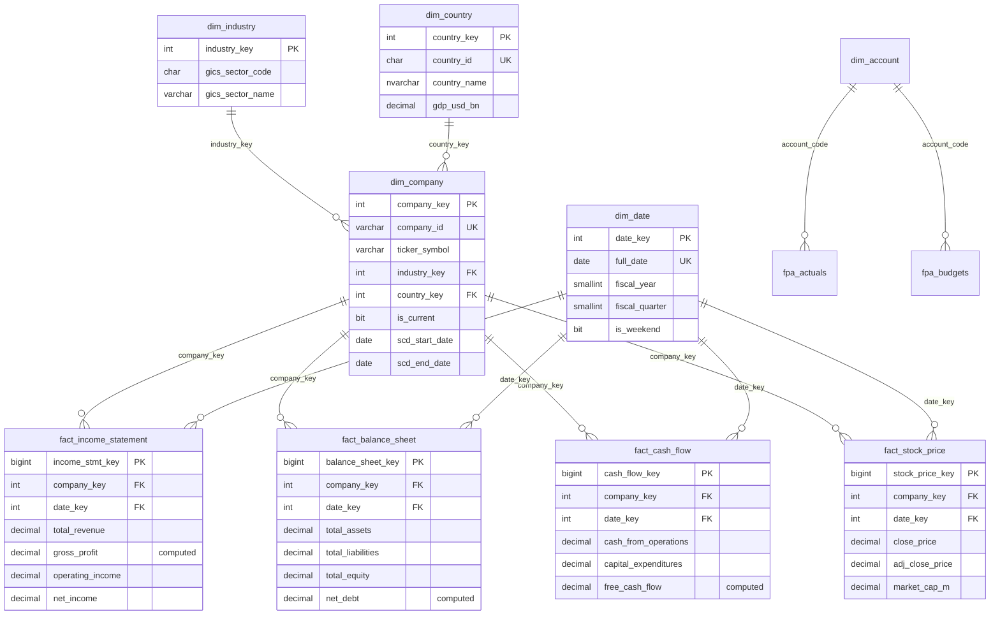
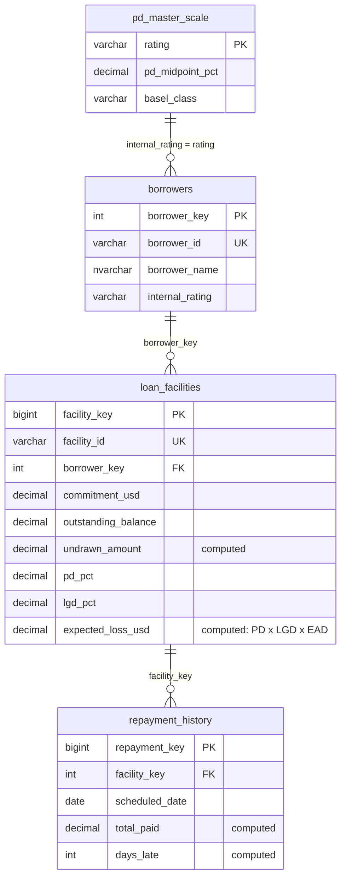
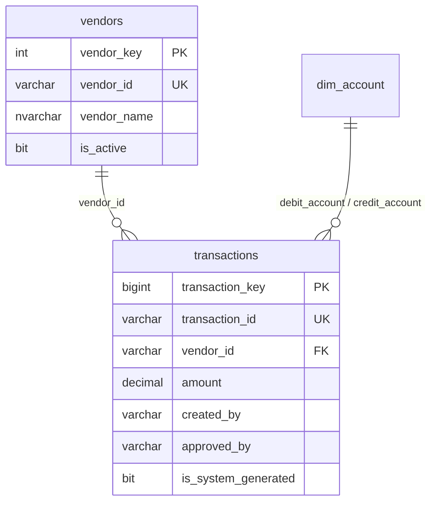
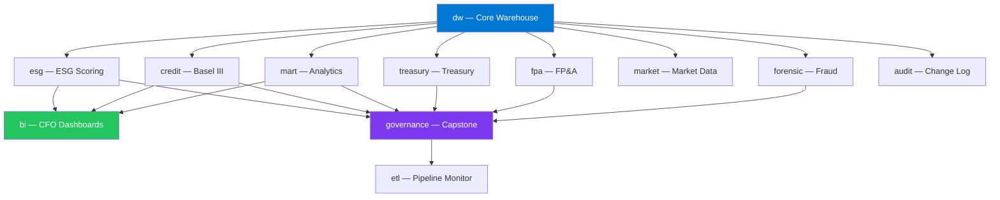

# 🗺️ Entity Relationship Diagram

> Text-based ERD for the `dw` schema star schema core, plus the major satellite schemas.
> Rendered as Mermaid — view this file directly on GitHub for the interactive diagram.

---

## Core Star Schema (`dw`)

---

## Credit Risk Domain (`credit`)

---

## Fraud Detection Domain (`forensic`)

---

## Schema Dependency Graph

---

## Reading the Diagrams on GitHub

GitHub natively renders [Mermaid](https://mermaid.js.org/) diagrams inside Markdown files —
no extra setup needed. If viewing this file outside GitHub (e.g. a plain text editor), paste
the code blocks above into the [Mermaid Live Editor](https://mermaid.live) to render them.
